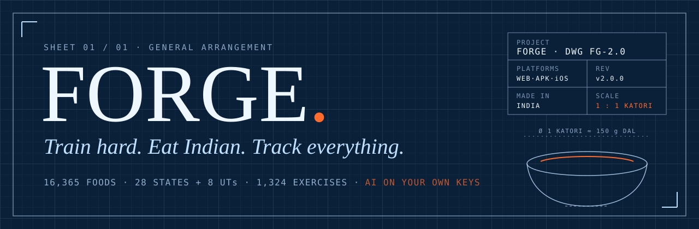
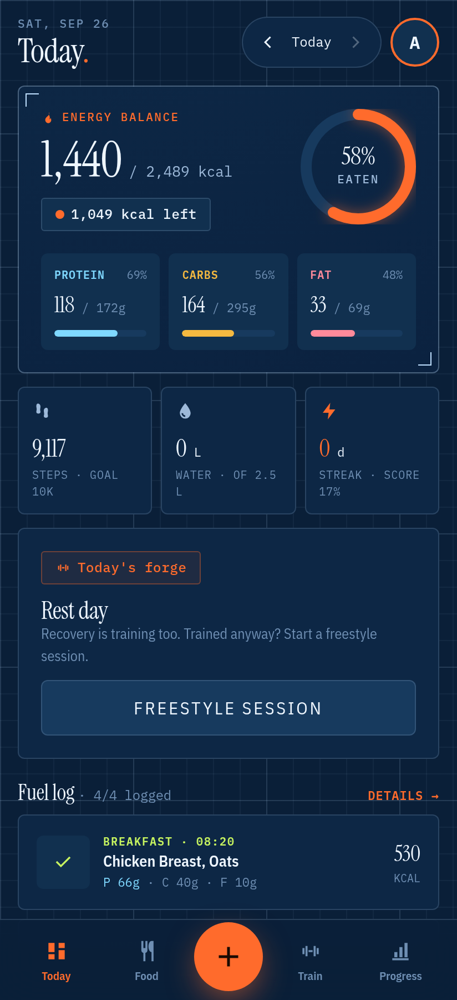
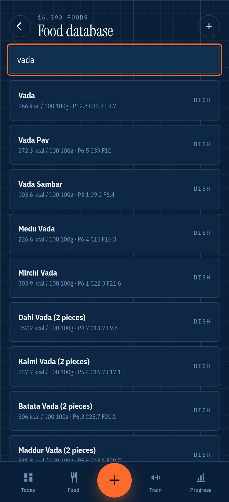
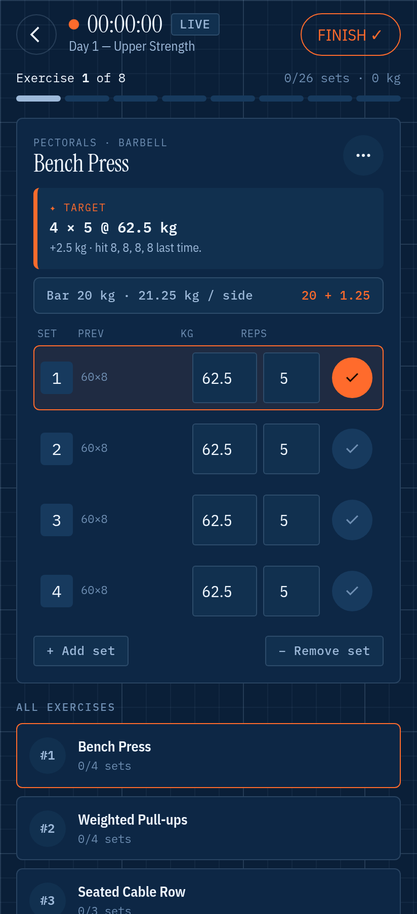
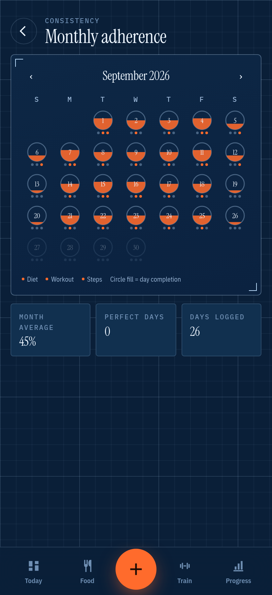

<p align="center">
  
</p>

<p align="center">
  <a href="https://forgefit-india.vercel.app/download/forge.apk"><b>⬇ Android APK</b></a> ·
  <a href="https://forgefit-india.vercel.app/app/"><b>Open the web app</b></a> ·
  <a href="https://forgefit-india.vercel.app"><b>Landing page</b></a> ·
  <a href="#install">iPhone</a>
</p>

<p align="center">
  
  
  
  
</p>

---

Every fitness app knows what 100 g of chicken breast is. Almost none of them know what **one vada pav**
is, or **a katori of dal**, or that your 12:40 AM post-gym paneer belongs to *yesterday*.

FORGE does. It's a free training + nutrition tracker built for how India actually eats and trains:
dishes from every state, logged by the piece and the katori, with real strength progression on the
other side and an AI food camera that runs on **your own** Gemini keys. No subscription. No ads.

<p align="center">
  
  
  
  
</p>
<p align="center"><sub>Today · 16,000+ foods · a live session with plate math · the adherence calendar</sub></p>

## What makes it different

### 🍛 A vada pav is one piece, not 100 grams
**16,365 foods**, including **736 dishes from all 28 states and 8 union territories**, each calculated
from its ingredients at the portion you're actually served. Plus 829 Indian Nutrient Databank recipes,
USDA, and Open Food Facts for anything with a barcode. Search "vada" and you get medu, batata, dahi,
mirchi, maddur and kalmi — not a single generic "fried snack".

### 📸 Snap your thali
The AI food camera finds each item on the plate, estimates portions from the plate and katori, then
**grounds every answer against the database** before you see it. Or just type *"2 roti, dal tadka,
bhindi"*. Every number stays editable; nothing is saved until you say so.

### 💣 Tell it you ate a nuclear bomb. It won't log it.
Every AI entry is checked twice. **Before** the model sees it: non-food, impossible amounts (40 rotis
at once) and prompt-injection tricks are refused. **After**: no food has more than 9 kcal per gram,
and protein + carbs + fat must add up to the calories. Numbers that don't make physical sense never
reach your diary.

### 🏋️ Gets you stronger, and tells you why
Hit all your reps and the weight goes up next session. Stall three times and it deloads so you can
rebuild. It tells you which plates to load, estimates your 1RM, spots PRs, and handles warm-ups,
supersets, timed sets and cardio. **1,324 exercises** with instructions in English *and* Hindi, a
muscle map that lights up by weekly volume, and a year heatmap. Coming from Strong or Hevy? Import
your whole history from CSV.

### 🌙 Gym after midnight still counts
Your day ends at **4 AM**, not 12 (configurable). Log to yesterday or any date in one tap.

### 📅 Honest consistency
A daily adherence score across diet, workout and steps, with weights you control. Rest days are
*not applicable*, never failures. The calendar shows each day as a filling circle, not a guilt-inducing
percentage.

### 🔐 Your keys, locked
You bring 2–5 free Gemini keys. They're encrypted server-side with AES-256-GCM, bound to your user id,
rotated when a quota runs dry, and **never shown again** — the app only ever sees the last four
characters. Row-level security means the database itself refuses to show your data to anyone else.
AI calls are rate-limited per user.

### ✈️ Works with zero credentials
No Supabase? It runs as an offline demo on localStorage. No Gemini keys? Manual logging and calculated
targets still work. Nothing is a dead button.

**Also in the box:** water, intermittent-fasting timer, steps, bodyweight trend, goals and a calculated
calorie/macro target, barcode scanning, quick meals, copy-yesterday, a physique check-in lab whose
photos never leave your device, an on-topic coach, and JSON/CSV export.

## Install

| | |
|---|---|
| **Android** | Download [`forge.apk`](https://forgefit-india.vercel.app/download/forge.apk), open it, allow "install unknown apps" if asked. Signed; the SHA-256 is on the [site](https://forgefit-india.vercel.app). |
| **iPhone** | Open [the web app](https://forgefit-india.vercel.app/app/) in Safari → Share → **Add to Home Screen**. Same app, full-screen, works offline. (A real App Store build needs a paid Apple Developer account; the Xcode project lives in `ios/`.) |
| **Web** | [forgefit-india.vercel.app/app](https://forgefit-india.vercel.app/app/) |

Then sign up with a name, email, password and 2–5 keys from
[aistudio.google.com/apikey](https://aistudio.google.com/apikey).

## Under the hood

```
React 19 + TypeScript + Vite 8 ─┬─ web app (PWA)      → Vercel  /app
Tailwind v4 · recharts · zod    ├─ Capacitor 8        → signed Android APK
                                └─ Capacitor 8        → iOS Xcode project
Supabase (auth + Postgres + RLS), reached through a /sb proxy — supabase.co is DNS-blocked on some Indian ISPs
Vercel functions: api/ai.ts (the only thing that talks to Gemini) · api/keys.ts (encrypted key storage)
```

Four rules the whole codebase is built around:

1. **Secrets never reach the browser.** Only the Supabase URL and publishable key are client-side.
2. **Deterministic first, AI second.** Calorie targets, progression and physique timelines are plain
   maths in `calc.ts` / `training.ts` / `physique.ts`. AI explains and personalises inside those bounds.
3. **AI output is untrusted input.** Validated with zod, clamped by deterministic code, one retry, then
   a graceful failure. It never writes to your data without you accepting.
4. **History is immutable.** A workout session snapshots its exercises, so editing a plan never rewrites
   the past.

The full architecture and conventions live in [CLAUDE.md](CLAUDE.md). The design system — *FORGE
Blueprint*: cyanotype grid paper, one ember signal colour, Instrument Serif over IBM Plex — is shared
with the landing page in `site/`.

## Run it locally

```bash
npm install
npm run dev          # http://localhost:5173/app/ — no credentials needed, runs in demo mode
npm test             # calc, AI guard, training maths, importers
npm run typecheck
```

<details>
<summary><b>Build, ship, and the backend</b></summary>

```bash
npm run build        # dist/ = landing + /app + /download
npm run apk          # signed release APK → release/forge.apk (needs JDK 21 + Android SDK)
npm run catalog      # rebuild public/food-catalog.json (state dishes + INDB)
npm run deploy       # Vercel production deploy
```

Server environment (Vercel): `SUPABASE_URL`, `SUPABASE_ANON_KEY`, `FORGE_KEY_SECRET` (32 random bytes,
base64). Database: run `supabase/migrations/0001_init.sql`, then `0002_v2.sql`.

</details>

## Credits

Food data from **USDA FoodData Central** (public domain), the **Indian Nutrient Databank**
(Vijayakumar A. et al., *Curr Dev Nutr* 2024) and **Open Food Facts** (ODbL). Exercise names and
instructions from [hasaneyldrm/exercises-dataset](https://github.com/hasaneyldrm/exercises-dataset)
(MIT; no third-party media shipped). Body map from react-native-body-highlighter (MIT). Some feature
ideas were inspired by [SmiTriX](https://github.com/SmitroniX/SmiTriX) and reimplemented from scratch;
none of its code was copied.

<p align="center"><sub>Drawn in India by Purval Singh · Scale 1 : 1 katori · FORGE is not medical advice.</sub></p>
